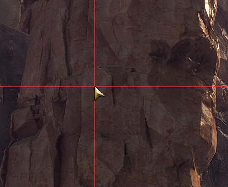

# Mouse Highlight

A [Nexus](https://raidcore.gg/Nexus) port of the [TacO](https://www.gw2taco.com/2015/01/feature-list.html) addon that renders a full-screen crosshair aligned to the mouse cursor.

## Options

- Either show always, in combat only or only out of combat
- Customize color and thickness of the crosshair

## Installation

> [!NOTE]
> You can install the addon directly through the in-game Nexus library with a single click.

If you prefer a manual install:

1. Download the latest [`mouse_highlight.dll`](https://github.com/mriot/mouse-highlight/releases/latest/download/mouse_highlight.dll)
2. Put the file into your Guild Wars 2 Nexus addons folder (e.g., `C:/Program Files/Guild Wars 2/addons`)
3. Enable the addon in-game in Nexus

## Credits

- Original addon by TacO
- Tiag for the idea to bring this to Nexus
